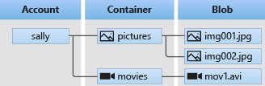

# Azure Blob Storage
Azure Blob storage is Microsoft's object storage solution for the cloud. Blob storage is optimized for storing massive amounts of unstructured data. Unstructured data is data that doesn't adhere to a particular data model or definition, such as text or binary data.

### Blob storage is designed for :

* Serving images or documents directly to a browser.
* Storing files for distributed access.
* Streaming video and audio.
* Writing to log files.
* Storing data for backup and restore, disaster recovery, and archiving.
* Storing data for analysis by an on-premises or Azure-hosted service.

## advantages of Blob storage :

1. Low-cost, tiered storage
2. High availability
3. Strong consistency
4. Disaster recovery capabilities

## Blob storage resources

* The storage account
* A container in the storage account
* A blob in a container

**the relationship between these resources**



## Storage accounts
A storage account provides a unique namespace in Azure for your data. Every object that you store in Azure Storage has an address that includes your unique account name. The combination of the account name and the Blob Storage endpoint forms the base address for the objects in your storage account.

For example, if your storage account is named mystorageaccount, then the default endpoint for Blob storage is:
```c#
http://mystorageaccount.blob.core.windows.net
```

## Blobs
Azure Storage supports three types of blobs:

* Block blobs store text and binary data. Block blobs are made up of blocks of data that can be managed individually. Block blobs can store up to about 190.7 TiB.

* Append blobs are made up of blocks like block blobs, but are optimized for append operations. Append blobs are ideal for scenarios such as logging data from virtual machines.

* Page blobs store random access files up to 8 TiB in size. Page blobs store virtual hard drive (VHD) files and serve as disks for Azure virtual machines. For more information about page blobs

