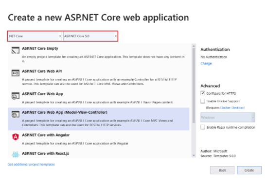

# Entity Framework and APIs

## Create web app
- Start Visual Studio and select Create a new project.
- In the Create a new project dialog, select ASP.NET Core Web Application > Next.
- In the Configure your new project dialog, enter ContosoUniversity for Project name. It's important to use this exact name including capitalization, so each namespace matches when code is copied.
- Select Create.
- In the Create a new ASP.NET Core web application dialog, select:
1. .NET Core and ASP.NET Core 5.0 in the dropdowns.
2. ASP.NET Core Web App (Model-View-Controller).
3. Create



## EF Core NuGet packages
The EF SQL Server package and its dependencies, Microsoft.EntityFrameworkCore and Microsoft.EntityFrameworkCore.Relational, provide runtime support for EF.

Add the Microsoft.AspNetCore.Diagnostics.EntityFrameworkCore NuGet package. In the Package Manager Console (PMC), enter the following commands to add the NuGet packages:
```
Install-Package Microsoft.AspNetCore.Diagnostics.EntityFrameworkCore
Install-Package Microsoft.EntityFrameworkCore.SqlServer
```

Every Entity is a class.

EF works best when Async.
Don't run operations in parallel.  use Await to keep each action in sync.

## Entity Framework Core

[Microsoft Docs - Entity Framework Core](https://docs.microsoft.com/en-us/ef/core/)

A *Model* consists of *Entity Classes* <--Class

Three ways to develop a model in EF

+ Generate from exsisting database
+ Hand Code a Model to match a database
+ Once model is created, use *EF Migrations*

Use *LINQ* <-- should be *LIQ* (I want it to anyway)

***CRUD*** Data using instances of *Entity* class

## Data Seeding

[Microsoft Docs - Data Seeding](https://docs.microsoft.com/en-us/ef/core/modeling/data-seeding)

How to seed data code example from MSDocs

```
modelBuilder.Entity<Blog>().HasData(
  new Blog {BlogId = 1, Url = "http://sample.com"}
  );
```

Create a new *object*

## Razor Pages with Entity Frameword

[Microsoft Docs - Razor Pages](https://docs.microsoft.com/en-us/aspnet/core/data/ef-rp/intro?view=aspnetcore-2.1&tabs=visual-studio)

+ Create a Model (Models Folder)
+ Create Entity Classes

Scaffolding a *Model* = produces pages for **CRUD**

## Enable User Secrets

[CodeFellows - Enabling user secrets](https://codefellows.github.io/code-401-dotnet-guide/resources/user-secrets.html)

Allows for certain data to remain locally and not be distributed.

This allows for setting of environment variables.  API Keys, UserName, Pwords, etc

## Intro to APIs

[Youtube - Intro to APIs](https://youtu.be/aIkpVzqLuhA)

--Viewed--

[&lt;--&#91;BACK&#93;](/README.md)
