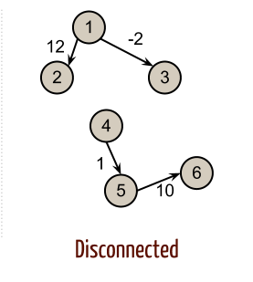

# Graphs
A graph is a `non-linear` data structure that can be looked at as a collection of `vertices` connected by line segments named `edges`.


* `Vertex` - A vertex, also called a “node”, is a data object that can have zero or more adjacent vertices.
* `Edge` - An edge is a connection between two nodes.
* `Neighbor` - The neighbors of a node are its adjacent nodes, i.e., are connected via an edge.
* `Degree` - The degree of a vertex is the number of edges connected to that vertex.

## Directed vs Undirected

### Undirected Graphs
An` Undirected Graph` is a graph where each edge is undirected or bi-directional. This means that the undirected graph does not move in any direction.

For example, in the graph below,` Node 1` is connected to `Node 2` and `Node 3`. There are no “directions” given to point to specific vertices. The connection is bi-directional.


The undirected graph we are looking at has 4 vertices and 4 undirected edges.

* Vertices/Nodes = {1,2,3,4}

* Edges = {(1,2),(1,3),(2,4),(3,4)}

### Directed Graphs (Digraph)
A `Directed Graph` also called a `Digraph` is a graph where every edge is directed.

Unlike an undirected graph, a `Digraph` has direction. Each node is directed at another node with a specific requirement of what node should be referenced next.

Compare the visual below with the undirected graph above. Can you see the difference? The Digraph has arrows pointing to specific nodes.


The directed graph above has 4 vertices and 4 directed edges

* Vertices/Nodes = {1,2,3,4}

* Edges = {(1,2),(1,3),(2,4),(4,3)}

## Complete vs Connected vs Disconnected

### Complete Graphs
A complete graph is when all nodes are connected to all other nodes.


### Connected Graphs

A connected graph is graph that has all of `vertices`/`nodes` have at least one edge.


### Disconnected Graphs
A disconnected graph is a graph where some `vertices` may not have `edges`.




## Acyclic vs Cyclic

### Acyclic Graph
An acyclic graph is a directed graph without cycles.

A cycle is when a node can be traversed through and potentially end up back at itself.

Here is an example of 3 acyclic graphs:


### Cyclic Graphs
A Cyclic graph is a graph that has cycles.

A cycle is defined as a path of a positive length that starts and ends at the same vertex.


## Graph Representation
We represent graphs through:

* Adjacency Matrix
* Adjacency List


### Adjacency Matrix

An Adjacency matrix is represented through a 2-dimensional array. If there are n vertices, then we are looking at an n x n Boolean matrix

Each Row and column represents each vertex of the data structure. The elements of both the column and the row must add up to 1 if there is an edge that connects the two, or zero if there isn’t a connection.


### Adjacency List

An adjacency list is the most common way to represent graphs.

An adjacency list is a collection of linked lists or array that lists all of the other vertices that are connected.

Adjacency lists make it easy to view if one vertices connects to another.


## Weighted Graphs

A weighted graph is a graph with numbers assigned to its edges. These numbers are called weights. This is what a weighted graph looks like:


When representing a weighted graph in a matrix, you set the element in the 2D array to represent the actual weight between the two paths. If there is not a connection between the two vertices, you can put a 0, although it is known for some people to put the infinity sign instead.

Using the graph from above, here is an example of what a weight matrix would look like:


Within adjacency lists, you must include both the weight and the name of the adjacent vertex.

Here is an example of what this may look like:


Do you notice the differences and similarities of a weighted adjacency list vs an unweighted? A great way to represent the {vertices, weight} connection is through some sort of key/value pair data structure.

## Traversals
You will be required to traverse through a graph. The traversals itself are like those of trees. Below is a breakdown of how you would traverse a graph.

### Breadth First

In a breadth first traversal, you are starting at a specific vertex/node. This node must be specified when calling the BreadthFirst() method. The breadth first traversal of a graph is like that of a tree, with the exception that graphs can have cycles. Traversing a graph that has cycles will result in an infinite loop….this is bad. To prevent such behavior, we need to have some way to keep track of whether a vertex has been “visited” before. Upon each visit, we’ll add the previously-unvisited vertex to a visited set, so we know not to visit it again as traversal continues.

As a refresher of what breadth first actually means here it is: Breadth first traversal is when you visit all the nodes that are closest to the root as possible. From there you traverse outwards, level by level, until you have visited all the vertices/nodes.

Here is what the algorithm breadth first traversal looks like:

* `Enqueue` the declared start node into the Queue.
* Create a loop that will run while the node still has nodes present.
* `Dequeue` the first node from the queue
* if the Dequeue‘d node has unvisited child nodes, add the unvisited children to visited set and insert them into the queue.

```c#
ALGORITHM BreadthFirst(vertex)
    DECLARE nodes <-- new List()
    DECLARE breadth <-- new Queue()
    DECLARE visited <-- new Set()

    breadth.Enqueue(vertex)
    visited.Add(vertex)

    while (breadth is not empty)
        DECLARE front <-- breadth.Dequeue()
        nodes.Add(front)

        for each child in front.Children
            if(child is not visited)
                visited.Add(child)
                breadth.Enqueue(child)

    return nodes;
```  

### Depth First
In a depth first traversal, our approach is a bit different than the approach used for breadth first. While the breadth first traversal uses a Queue to visit all children at a given level, the depth first traversal uses a Stack to visit all children of a given subtree. (This differs from our approach to tree traversal, where we visit nodes via recursive calls. Recursive calls use a call stack internally.)

The algorithm for a depth first traversal is as follows:

* `Push` the root node into the Stack and mark as visited.
* Start a while loop that runs as long as the stack is not empty.
* `Pop` the top node off of the stack and check its neighbors.
* If a neighbor hasn’t been visited, push it onto the stack and mark as visited.
* Repeat until the stack is empty.


## Real World Uses of Graphs

1. GPS and Mapping
2. Driving Directions
3. Social Networks
4. Airline Traffic
5. Netflix uses graphs for suggestions of products


