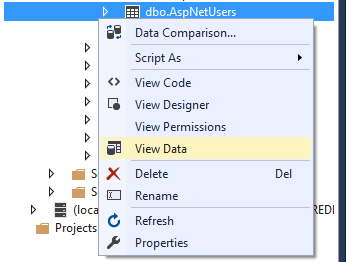

# Identity
ASP.NET Core Identity:

* Is an API that supports user interface (UI) login functionality.
* Manages users, passwords, profile data, roles, claims, tokens, email confirmation, and more.

### Microsoft identity platform is:

* An evolution of the Azure Active Directory (Azure AD) developer platform.
* Unrelated to ASP.NET Core Identity.

#### ASP.NET Core Identity adds user interface (UI) login functionality to ASP.NET Core web apps. To secure web APIs and SPAs, use one of the following:

* Azure Active Directory
* Azure Active Directory B2C (Azure AD B2C)
* IdentityServer4

## View the Identity database




## Test Identity
The default web project templates allow anonymous access to the home pages. To test Identity, add [Authorize]:

```
 [Authorize]
    public class PrivacyModel : PageModel
    {
        private readonly ILogger<PrivacyModel> _logger;

        public PrivacyModel(ILogger<PrivacyModel> logger)
        {
            _logger = logger;
        }

        public void OnGet()
        {
        }
```