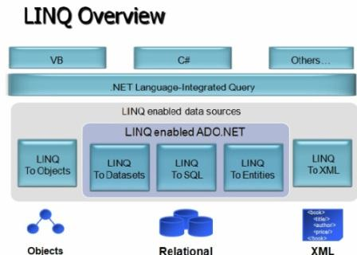

# LINQ(Language Integrated Query)

LINQ in C# is used to work with data access from sources such as objects, data sets, SQL Server, and XML. LINQ stands for Language Integrated Query. LINQ is a data querying API with SQL like query syntaxes. LINQ provides functions to query cached data from all kinds of data sources. The data source could be a collection of objects, database or XML files. We can easily retrieve data from any object that implements the IEnumerable<T> interface.



## Advantages of LINQ

* LINQ offers an object-based, language-integrated way to query over data no matter where that data came from. So through  LINQ we can query database, XML as well as collections. 
* Compile time syntax checking
* It allows you to query collections like arrays, enumerable classes etc in the native language of your application, like VB or C# in much the same way as you would query a database using SQL

## LINQ Code Examples

```
JObject o = JObject.Parse(@"{
  'CPU': 'Intel',
  'Drives': [
    'DVD read/writer',
    '500 gigabyte hard drive'
  ]
}");

string cpu = (string)o["CPU"];
// Intel

string firstDrive = (string)o["Drives"][0];
// DVD read/writer

IList<string> allDrives = o["Drives"].Select(t => (string)t).ToList();
// DVD read/writer
// 500 gigabyte hard drive
```