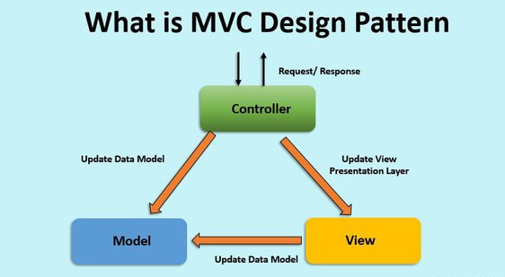

## Intro to MVC

MVC is a `design pattern` or architecture which helps in developing the web application in a most efficient way when compared with the traditional ASP.NET Web Application.

| traditional ASP.NET | MVC |
| :---:    | :---    |
| the user action and view (UI) are combined|the View only deals with UI of the page and the user actions are defined in Controller |
| View based architecture   |  action-based architecture |
|View State is used to maintain the state of the web page|we don’t have View State to store the state information|
|where entire Page Life cycle is undergone for each request, the response time of the web page is very high which is not user friendly|we don’t have the concept of page life cycle. When a request is made, the request hits the Controller which, in turn, hits the appropriate action. Then, the controller collects the required data from model and it is rendered in the appropriate View to user. So the response time is very low|
|testing is tedious task as both View (UI) and Business logic (code behind) are tightly coupled. We cannot test code-behind separately|it enhances the test-driven development by making the UI and action logic loosely coupled. As Models, Controllers and Views are all separate layers, they can be tested easily|

### Basically, MVC makes the design of the application into three layers namely `Model`, `View`, and `Controller`. Each of these components are built to handle different aspects of the application.

### Model :
represent the objects in our Application. Model is also a class which has all the objects and its properties and methods defined in it.

### View :
has all the html controls which define the UI of the application. Here in MVC, we don’t have drag and drop option for controls as we don’t use server controls. Instead we use Razor Engine available with Visual Studio by default which helps in rendering the View.

Views are files with .cshtml extensions. .cshtml contain both html and server code.

And also, using `‘@’, we can access C#` code so that in our page which can access server side dynamic data.

### Controller :
basically handles the request from user. It is the heart of the MVC application as everyone say. It is responsible to handle the request and return a response to user by loading appropriate View with data from Model.

Controller is a class with a group of methods called actions. And Every action method returns view. A View can be anything like it can be `xml` or `html` or `JSON` etc.

Controller maps the incoming user requests to appropriate Controller actions with the help of process called `Routing`.

Routing process internally creates a table called `Route Table` which describes which action to be taken for each request from user. The route table is created during the Application Start event. Routes are `URL patterns` created dynamically based on incoming request.

>According to the requirement of application, an appropriate framework can be selected to develop the application.

* ASP.NET MVC can be used to develop light-weight applications. This design pattern will also be useful when an application is being developed by large team as it can be controlled and maintained effectively. And one more advantage is that a few developers can work on View (UI part) and others on Models and others on Controller logic. And later, all the three can be integrated. It can also be used for large-scale applications.

* For RAD Models and small scale applications, it’s always better to go with traditional ASP.net Web Application Framework.