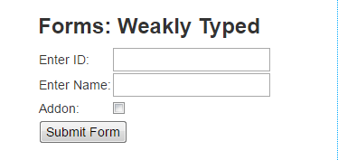
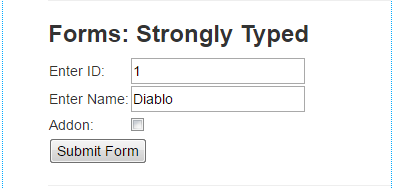
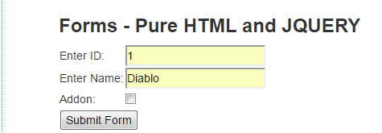

# MVC Forms :
How to create Forms in ASP.NET MVC?

1. Create a New ASP.NET MVC Project
2. Create a model class

## FORMS – WEAKLY TYPED

1. Go to => Views => Home =>  Index.cshtml and update it with following code:

```html
<h4 style="color:purple">
    <b>ID:</b>    @ViewBag.ID <br />
    <b>Name:</b>  @ViewBag.Name <br />
    <b>Addon:</b> @ViewBag.Addon
</h4>
<hr />
<h3><b>Forms: Weakly Typed</b></h3>
 
<form action="form1" method="post">
    <table>
        <tr>
            <td>Enter ID: </td>
            <td><input type="text" name="txtId" /></td>
        </tr>
        <tr>
            <td>Enter Name: </td>
            <td><input type="text" name="txtName" /></td>
        </tr>
        <tr>
            <td>Addon: </td>
            <td><input type="checkbox" name="chkAddon" /></td>
        </tr>
        <tr>
            <td colspan="2"><input type="submit" value="Submit Form" /></td>
        </tr>
    </table>
</form>
```
2. add an action method for this form in `HomeController.cs` :
```c#
[HttpPost] 
        public ActionResult form1(int txtId, string txtName, string chkAddon)
        {
            ViewBag.Id = txtId;
            ViewBag.Name = txtName;
            if (chkAddon != null)
                ViewBag.Addon = "Selected";
            else
                ViewBag.Addon = "Not Selected";
 
            return View("Index");
        }
```

### Output:


## Advantage and Disadvantage of Weakly Typed Form

### Advantage:
1. It is easy to create a form using Weakly Typed mechanism
2. Mostly used when you need to create a form with one or two input items.

### Disadvantage:
1. Because, it is not strongly typed so IntelliSense doesn't help you.
2. Have higher chance of getting exception and runtime error messages.

## FORMS : STRONGLY TYPED

n this method, we send objects (model) instead of sending each item as parameter. It is easy to maintain because you don't need to remember each input item and IntelliSense will show you automatically the each item.

1. Go to `Index.cshtml` and update the code like this:
```html
@model MvcForms.Models.StudentModel
<h4 style="color:purple">
    <b>ID:</b>    @ViewBag.ID <br />
    <b>Name:</b>  @ViewBag.Name <br />
    <b>Addon:</b> @ViewBag.Addon
</h4>
<hr />
<h3><b>Forms: Strongly Typed</b></h3>
 
@using (Html.BeginForm("Form2", "Home", FormMethod.Post))
{ 
    <table>
        <tr>
            <td>Enter ID: </td>
            <td>@Html.TextBoxFor(m => m.Id)</td>
        </tr>
        <tr>
            <td>Enter Name: </td>
            <td>@Html.TextBoxFor(m => m.Name)</td>
        </tr>
        <tr>
            <td>Addon: </td>
            <td>@Html.CheckBoxFor(m => m.Addon)</td>
        </tr>
        <tr>
            <td colspan="2"><input type="submit" value="Submit Form" /></td>
        </tr>
    </table>
```
2. Go to `HomeController.cs` and add the following action method:
```c#
[HttpPost] 
        public ActionResult Form2(Models.StudentModel sm)
        {
            ViewBag.Id = sm.Id;
            ViewBag.Name = sm.Name;
            if (sm.Addon == true)
                ViewBag.Addon = "Selected";
            else
                ViewBag.Addon = "Not Selected";
 
            return View("Index");
        }
```

### Output:



## STRONGLY TYPED AJAX (ASYNCHRONOUS)
Asynchronous AJAX form is a very magical way to submit data to the controller without happening page load. Asynchronous AJAX Forms simply post back the data to the controllers and update the only that part of the page, which has to display output.

To make this happen, we will use JQuery-Unobstrusive-AJAX. This is a great feature which is launched in MVC 3. It helps you to create AJAX Form without writing bunch of javascript code. Before creating Asynchronous AJAX Form you need to add JQuery-Unobstrusive-AJAX in your project. Adding is very easy, and just follows the steps.


1. Right-click on your Project name in Solution Explorer and click Manage Nuget Packages…

2. Go to Browse and search for ajax. Find and Install `Microsoft-JQuery-Unobstrusive-Ajax`.

3. After installing this you can see it in Script folder.

4. Create Form in `Index.cshtml`
```html
@model MvcForms.Models.StudentModel
<script src="@Url.Content("~/Scripts/jquery-1.10.2.min.js")" type="text/javascript"></script>
<script src="@Url.Content("~/Scripts/jquery.unobtrusive-ajax.js")" type="text/javascript"></script>
 
<h4 id="id1" style="color:purple"></h4>
<hr />
<h3><b>Forms - Strongly Typed AJAX (Asynchronous)</b></h3>
    @using (Ajax.BeginForm("Form3", "Home", new AjaxOptions
    {
        HttpMethod = "POST",
        UpdateTargetId = "id1",
        LoadingElementId = "LoadingImage",
        OnSuccess = "onSuccess_Message",
        OnFailure="onFailure_Message"
        
    }))
    {
        <table>
            <tr>
                <td>Enter ID: </td>
                <td>@Html.TextBoxFor(m => m.Id)</td>
            </tr>
            <tr>
                <td>Enter Name: </td>
                <td>@Html.TextBoxFor(m => m.Name)</td>
            </tr>
            <tr>
                <td>Addon: </td>
                <td>@Html.CheckBoxFor(m => m.Addon)</td>
            </tr>
            <tr>
                <td colspan="2"><input type="submit" value="Submit Form" /></td>
            </tr>
        </table>
        <div id="LoadingImage" style="display:none">Loading...</div>
        <div id="onSuccess_Message"></div>
        <div id="onFailure_Message"></div>
    }
```    

5. Go to `HomeController` and add the following action method:
```c#
[HttpPost] 
        public ActionResult Form3(Models.StudentModel sm)
        {
            if(ModelState.IsValid)
            {
                System.Text.StringBuilder sb = new System.Text.StringBuilder();
                sb.Append("ID: " + sm.Id + "<br />");
                sb.Append("Name: " + sm.Name + "<br />");
                sb.Append("Addon: " + sm.Addon + "<br />");
                return Content(sb.ToString());
            }
            else
            {
                return View("Index");
            }            
        }
```


### Output:


## PURE HTML FORMS WITH AJAX AND JQUERY

In this method, you can not only send data from input controls but can also use html elements like <p>…</p>, <span>…</span> to send data to controllers. This is pure JQuery and AJAX query.

1. Go to `Index.cshtml` and create form like this.
```html

<h3><b>Forms - Pure HTML and JQUERY</b></h3>
 
    <table>
        <tr>
            <td>Enter ID: </td>
            <td><input type="text" id="Id" /></td>
        </tr>
        <tr>
            <td>Enter Name: </td>
            <td><input type="text" id="Name" /></td>
        </tr>
        <tr>
            <td>Addon: </td>
            <td><input type="checkbox" id="Addon" /></td>
        </tr>
        <tr>
            <td colspan="2"><button onclick="submit()">Submit Form</button></td>
        </tr>
    </table>
 
<h4 style="color:purple" id="output"></h4>
 
<script src="~/Scripts/jquery-1.10.2.min.js" type="text/javascript"></script>
<script>
    function submit(){
        var data = {
            Id: $('#Id').val(),
            Name: $('#Name').val(),
            Addon: $('#Addon').is(':checked')
        };
 
        $.post("/Home/Form4", { sm: data }, function () { alert('Successfully Saved') });
    }
</script>
```

2. Go to HomeController and add following action method:

```c#
[HttpPost] 
        public ActionResult Form4(StudentModel sm)
        {
            string value = "ID: "+ Convert.ToString(sm.Id) 
                + "<br />Name: " + sm.Name 
                + "<br />Addon: " + Convert.ToString(sm.Addon);
 
            string s = "$('#output').html('" + value + "');";
            return JavaScript(s);
        }
```

### Output:



    


