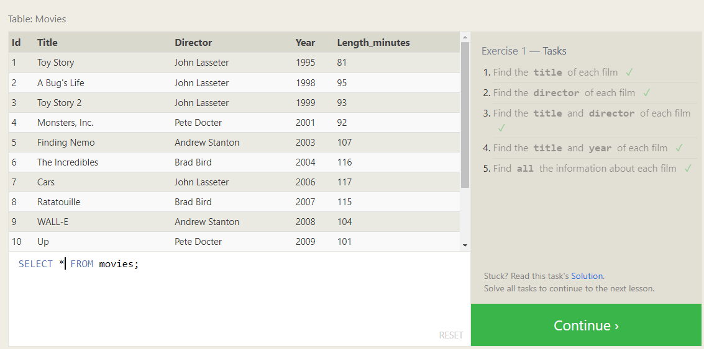
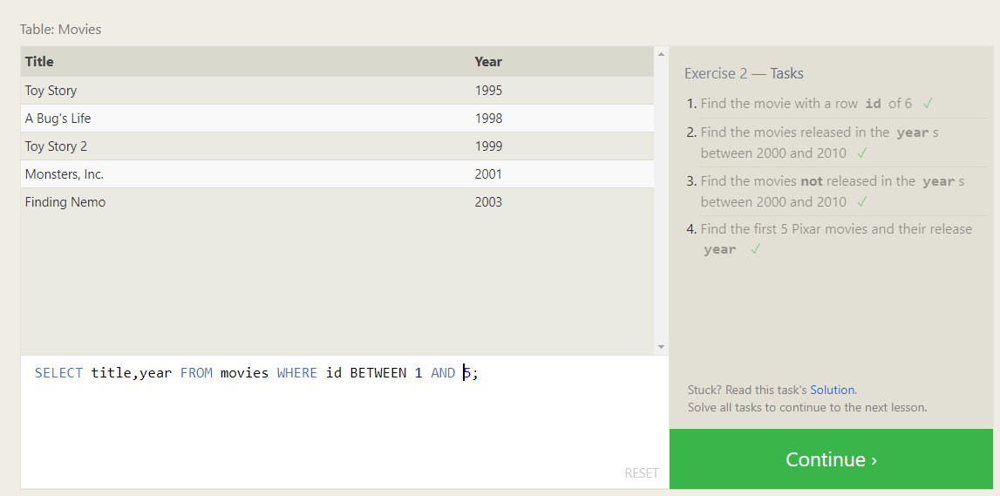
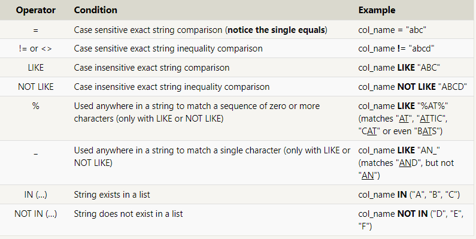
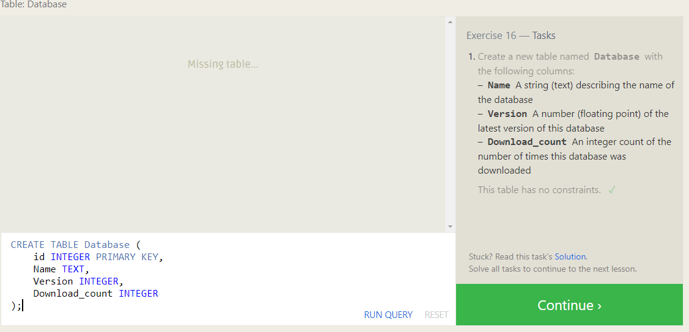
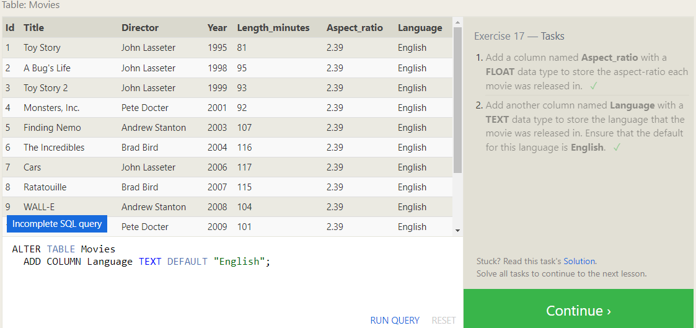
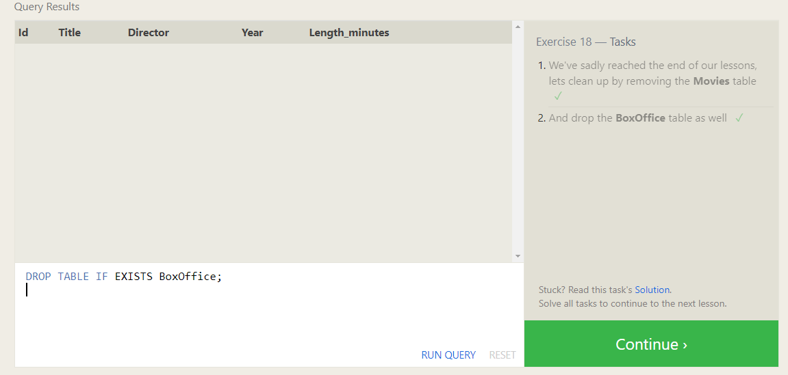

# databases and SQL


## SQL Lesson 1: SELECT queries 101


**Select query for a specific columns**
```
SELECT column FROM mytable;
```
**Select query for all columns**
```
SELECT * FROM mytable;
```
**task 1**



## SQL Lesson 2: Queries with constraints

**Select query with constraints**
```
SELECT column FROM mytable WHERE condition AND/OR another_condition ;
   
```

**task 2**


## SQL Lesson 3: Queries with constraints (Pt. 2)




**task 3**


## SQL Lesson 4: Filtering and sorting Query results

**DISTINCT**
DISTINCT keyword will blindly remove duplicate rows

```
SELECT DISTINCT column FROM mytable WHERE condition(s);
```

**Ordering results**

```
SELECT column FROM mytable WHERE condition(s) ORDER BY column ASC/DESC;
```

**Limiting results to a subset**
```
SELECT column FROM mytable WHERE condition(s) ORDER BY column ASC/DESC LIMIT num_limit OFFSET num_offset;
```

**task 4**


## SQL Review: Simple SELECT Queries

**task 5**


## SQL Lesson 6: Multi-table queries with JOINs

**Select query with INNER JOIN on multiple tables**
```
Select query with INNER JOIN on multiple tables
SELECT column, another_table_column, …
FROM mytable
INNER JOIN another_table 
    ON mytable.id = another_table.id
WHERE condition(s)
ORDER BY column, … ASC/DESC
LIMIT num_limit OFFSET num_offset;
```

**task 6**


## SQL Lesson 13: Inserting rows

**INSERT**

```
INSERT INTO mytable
VALUES (value_or_expr, another_value_or_expr, …),
       (value_or_expr_2, another_value_or_expr_2, …),
       …;
```
**task 13**


## SQL Lesson 14: Updating rows

**UPDATE**
```
UPDATE mytable
SET column = value_or_expr, 
    other_column = another_value_or_expr, 
    …
WHERE condition;
```

**task 14**


## SQL Lesson 15: Deleting rows

**DELETE**
```
DELETE FROM mytable WHERE condition;
```
**task 15**


## SQL Lesson 16: Creating tables

**CREATE TABLE**
```
CREATE TABLE movies (
    id INTEGER PRIMARY KEY,
    title TEXT,
    director TEXT,
    year INTEGER, 
    length_minutes INTEGER
);
```
**task 16**


## SQL Lesson 17: Altering tables

**Adding columns**
```
ALTER TABLE mytable
ADD column DataType OptionalTableConstraint 
    DEFAULT default_value;
```

**Removing columns**

```
ALTER TABLE mytable
DROP column_to_be_deleted;
```

**Renaming the table**

```
ALTER TABLE mytable
RENAME TO new_table_name;
```
**task 17**


## SQL Lesson 18: Dropping tables

**DROP TABLE**

```
DROP TABLE IF EXISTS mytable;
```


**task 18**


