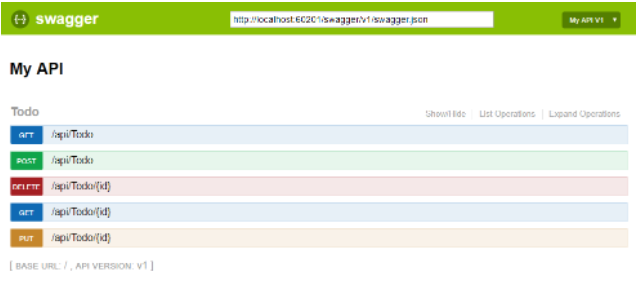

## Unit Tests for ASP.NET 

>Creating the Controller under Test :

```
using System;
using System.Web.Mvc;

namespace Store.Controllers
{
     public class ProductController : Controller
     {
          public ActionResult Index()
          {
               // Add action logic here
               throw new NotImplementedException();
          }

          public ActionResult Details(int Id)
          {

               return View("Details");
          }
     }
}
```

The ProductController contains two action methods named Index() and Details(). Both action methods return a view. Notice that the Details() action accepts a parameter named Id.


## Testing the View returned by a Controller

Imagine that we want to test whether or not the ProductController returns the right view. We want to make sure that when the ProductController.Details() action is invoked, the Details view is returned. The test class in Listing 2 contains a unit test for testing the view returned by the ProductController.Details() action.

```
[TestClass]
     public class ProductControllerTest
     {
          [TestMethod]
          public void TestDetailsView()
          {
               var controller = new ProductController();
               var result = controller.Details(2) as ViewResult;
               Assert.AreEqual("Details", result.ViewName);

          }
```

## Testing the Action Result
A more complex controller action might return different types of action results depending on the values of the parameters passed to the controller action.

```
[TestClass]
     public class ProductControllerTest
     {
          [TestMethod]
          public void TestDetailsRedirect()
          {
               var controller = new ProductController();
               var result = (RedirectToRouteResult) controller.Details(-1);
               Assert.AreEqual("Index", result.Values["action"]);

          }
```


# Documentation with Swagger

The Swagger project was donated to the OpenAPI Initiative in 2015 and has since been referred to as OpenAPI. Both names are used interchangeably. However, "OpenAPI" refers to the specification. "Swagger" refers to the family of open-source and commercial products from SmartBear that work with the OpenAPI Specification. Subsequent open-source products, such as OpenAPIGenerator, also fall under the Swagger family name, despite not being released by SmartBear.

In short:
* OpenAPI is a specification.
* Swagger is tooling that uses the OpenAPI specification. For example, OpenAPIGenerator and SwaggerUI.



