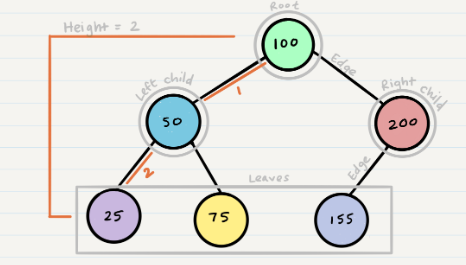

# Trees

* `Node` A Tree node is a component which may contain its own values, and references to other nodes
* `Root` The root is the node at the beginning of the tree
K - A number that specifies the maximum number of children any node may have in a k-ary tree. In a binary tree, k = 2.
* `Left` A reference to one child node, in a binary tree
* `Right` A reference to the other child node, in a binary tree
* `Edge` The edge in a tree is the link between a parent and child node
* `Leaf` leaf is a node that does not have any children
* `Height` The height of a tree is the number of edges from the root to the furthest leaf



## Traversals

>There are two categories of traversals when it comes to trees:

* Depth First
* Breadth First

## Depth First

`Depth first` traversal is where we prioritize going through the depth (height) of the tree first

>Here are three methods for depth first traversal:

1. `re-order` : root >> left >> right
2. `In-order` : left >> root >> right
3. `Post-order` : left >> right >> root

Example :


* Pre-order: A, B, D, E, C, F
* In-order: D, B, E, A, F, C
* Post-order: D, E, B, F, C, A

**Pre-order**

```
ALGORITHM preOrder(root)

  OUTPUT <-- root.value

  if root.left is not NULL
      preOrder(root.left)

  if root.right is not NULL
      preOrder(root.right)
```

**In-order**
```
ALGORITHM inOrder(root)
// INPUT <-- root node
// OUTPUT <-- in-order output of tree node's values

    if root.left is not NULL
        inOrder(root.left)

    OUTPUT <-- root.value

    if root.right is not NULL
        inOrder(root.right
```

**Post-order**
```
ALGORITHM postOrder(root)
// INPUT <-- root node
// OUTPUT <-- post-order output of tree node's values

    if root.left is not NULL
        postOrder(root.left)

    if root.right is not NULL
        postOrder(root.right)

    OUTPUT <-- root.value
```

## Breadth First
`Breadth first` traversal iterates through the tree by going through each level of the tree node-by-node. So, given our starting tree one more time:


* Breadth first: A, B, C, D, E, F

```
ALGORITHM breadthFirst(root)
// INPUT  <-- root node
// OUTPUT <-- front node of queue to console

  Queue breadth <-- new Queue()
  breadth.enqueue(root)

  while ! breadth.is_empty()
    node front = breadth.dequeue()
    OUTPUT <-- front.value

    if front.left is not NULL
      breadth.enqueue(front.left)

    if front.right is not NULL
      breadth.enqueue(front.right)
```

## Big O

The Big O time complexity for `inserting` a new node is `O(n)`. 
`Searching` for a specific node will also be `O(n)`.

## Binary Search Trees

Searching a BST can be done quickly, because all you do is compare the node you are searching for against the root of the tree or sub-tree. If the value is smaller, you only traverse the left side. If the value is larger, you only traverse the right side.


