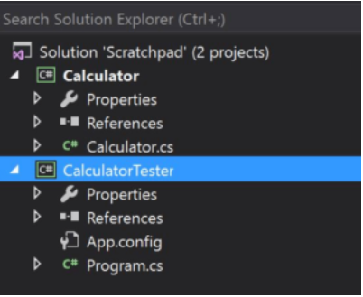

# Unit Testing
> Unit tests don’t deal with their environment and with external systems to the codebase.

> don’t count as other sorts of tests.

> don’t exercise multiple components of your system and how they act. 

## Unit Testing Tutorial

## Unit Testing Best Practices
* Arrange, Act, Assert
* One Assert Per Test Method
* Avoid Test Interdependence
* Keep It Short, Sweet, and Visible
* Recognize Test Setup Pain as a Smell
* Add Them to the Build